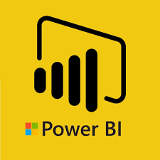

# Marcus Vos Portfolio

Welcome to my portfolio. Click the images below to view the projects:

Welcome to my portfolio! I bring together practical experience and strong analytical skills, with a Bachelor’s in Biological Sciences and a Master’s in Business Analytics, both from Nanyang Technological University.

This portfolio is divided into sections—Data Cleaning, Data Visualization, Data Analysis, and Machine Learning—each showcasing my expertise in these areas. 
My primary focus is data visualization using Power BI. Each project is linked to its corresponding GitHub repository, where you can explore the code and detailed documentation. 
I invite you to explore this collection to see how my passion for data analytics has shaped my career.

Feel free to contact me at marcusvos93@gmail.com.
